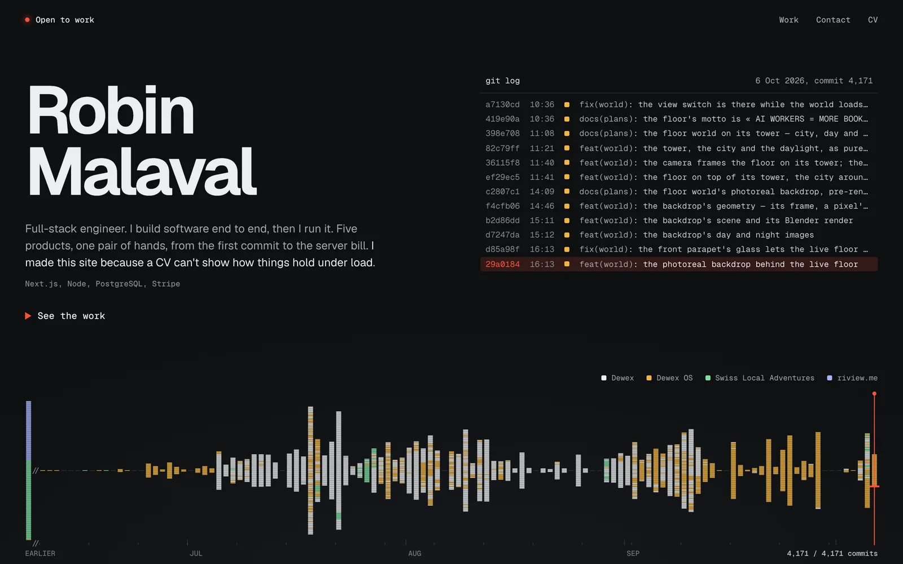
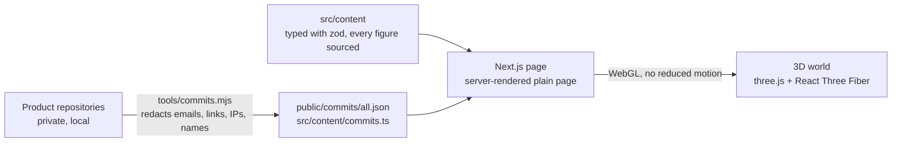

# Robin Malaval, portfolio

**[robinmalaval.com](https://robinmalaval.com)**

**A portfolio whose hero is the real commit history of the products it shows.** Every line of the
waveform is one commit, coloured by product: more than 4,000 of them, from the first commit to
production. Below it, each product stands in a WebGL carousel on its own history, with its screens,
its stack and numbers that each point to where they were measured.



## The products it shows

| Product | What it is | Stack |
|---|---|---|
| [Dewex](https://dewex.io) | Booking SaaS in production: every outdoor activity operator gets their own branded site, calendar and Stripe account, all served by one Next.js app | Next.js, PostgreSQL, Stripe Connect, BullMQ |
| Dewex OS | The internal platform that runs the company: lead analysis, human QA, an AI demo factory, outreach, finance. 13 BullMQ queues, 9 supervised LLM agents | Next.js, BullMQ, Redis, OpenAI |
| [Swiss Local Adventures](https://www.swisslocaladventures.ch) | Four-language booking site for a Swiss tour operator, with GetYourGuide's Supplier API implemented both ways | Next.js, Supabase, Stripe, GetYourGuide API |
| [riview.me](https://riview.me) | Turns a QR scan at a restaurant table into a Google review or private feedback, gated by a sign-in and a reward wheel | Next.js, Prisma, Stripe, NextAuth |

The product repositories are private. This repository is the site, and its commit data is generated
from them (see below).


## How the site works

1. **The hero** is a canvas. With no pointer the history plays by itself; the pointer picks a day and
   a commit and the log prints it; a click replays fast from there; the legend keeps one product only.
2. **The work** is a three.js scene: the product covers stand on a circle in front of the camera.
   Scrolling inside a product lifts its screens one by one. Dewex is shown by its 46-second product
   film, which only plays, with sound, when it is clicked.
3. **The final sheet** rises over the world with the side projects and the contact.
4. **The plain page comes first.** The server renders a complete page with no WebGL: nav, hero,
   products, contact. The 3D world replaces it only on the client, and only when WebGL is there and
   no reduced motion is requested. It is loaded after the hero has painted, so the first paint never
   waits for it.



## Design choices worth a look

- **No invented numbers.** Content is typed data validated with zod
  ([`src/content/schema.ts`](src/content/schema.ts)). Every metric carries a `source`: the command, file
  or commit it was measured from. A figure that could not be checked in a repository is left out.
- **Copy rules are tests.** [`src/content/rules.ts`](src/content/rules.ts) rejects any string of the
  site with an em dash, a placeholder or a pleading tone, and the content tests run it on every string.
- **Commit messages published, private data not.** [`tools/commits.mjs`](tools/commits.mjs) reads
  each product's git log and writes the site's commit data. It replaces emails, links, IP addresses,
  phone numbers and every name of a git-ignored deny list (the list itself must stay private). A test
  fails if an email, link or IP address reaches the published data.
- **The 3D world is a pure state machine.** [`src/lib/world/state.ts`](src/lib/world/state.ts) knows
  no DOM and no three.js: a virtual scroll with a magnet that settles on the nearest stop, unit
  tested. One render loop drives everything; the DOM layers (hero lift, sheet rise) write their
  transforms from it without re-rendering React.
- **One capability check decides the experience.** [`src/lib/world/support.ts`](src/lib/world/support.ts)
  returns `full` (desktop WebGL), `lite` (the same scene, cheaper, on small viewports) or `none` (the
  plain page).

## Stack

TypeScript · Next.js 16 (App Router) · React 19 · three.js, React Three Fiber, drei · Tailwind CSS 4 ·
zod · Vitest and Testing Library · sharp (asset pipeline).

```
src/app              page, metadata, Open Graph image, sitemap, robots
src/components/hero  the commit history canvas
src/components/world the WebGL experience: scene, overlays, final sheet
src/components/rooms the products on the plain page
src/components/sheet side projects and contact
src/content          typed content: products, copy, commit summary, copy rules
src/lib/world        pure world logic: state machine, layout, input, capability check
tools/commits.mjs    product git histories to commit data, redacted
scripts/assets.mjs   source screenshots and logos to optimised files in public/
```

## Run it

Requires Node 22 (the version CI uses).

```bash
npm install
npm run dev
```

```bash
npm test
npm run lint
npm run typecheck
npm run build
```

`NEXT_PUBLIC_SITE_URL` sets the canonical URL (it falls back to the Vercel production URL, then to
localhost). The commit data is committed: `node tools/commits.mjs` regenerates it, but only on a
machine that holds the product repositories.

GitHub Actions runs lint, typecheck, tests and build on every push and pull request. A pre-commit hook
lints the staged files.

## How it was built

Spec first, then implementation plans. Tasks were executed with AI coding agents, test-first, and every
diff was reviewed before merge.

## License

The code is [MIT](LICENSE). The content is not: the product screenshots, the Dewex film, the logos, the
copy and the commit data belong to their owners and are not licensed for reuse.
